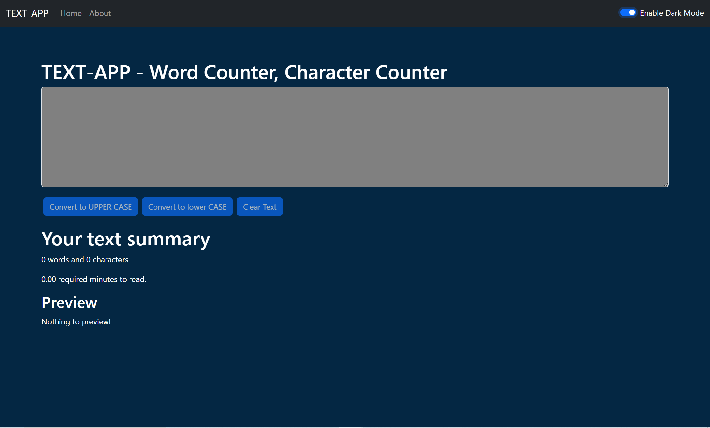

# Text Counter App ✍️

Effortlessly count words, characters, and check readability with **Text Counter App**. This React-powered tool offers real-time text analysis with a sleek and responsive design. Perfect for quick content evaluation!

---

## 🚀 Features

- 📊 **Word & Character Count**: Instantly displays the number of words and characters in your input.
- 📖 **Readability Score**: Analyzes the complexity of the text.
- 🔄 **Text Transformation**: Convert text to uppercase, lowercase, or other formats.
- 📱 **Responsive Design**: Enjoy seamless use across all devices, from desktop to mobile.

---

## 🌐 Live Demo

Check out the live app here:  
🔗 **[Text Counter App Live](https://textcounterapp.netlify.app)**

---

## 🎥 Demo GIF

Here's how the Text Counter App works in action:


---

## 🖼️ Screenshot

Here's a quick look at the app's homepage:



---

## 🛠️ Technologies Used

- **React**
- **HTML**
- **CSS**
- **JavaScript**
- **React Hooks**
- **Deployment**: Netlify

---

## ⚙️ How to Install

Follow these steps to get the project up and running locally:

### Prerequisites

- **Node.js** and **npm** installed on your machine.
- **Git** installed.

### Steps

1. **Clone the Repository**

   ```bash
   git clone https://github.com/Niranjan-Kumar-Singh/Text-App_reactLearning.git
   ```

2. **Navigate to the Project Directory**

   ```bash
   cd Text-App_reactLearning
   ```

3. **Install Dependencies**

   ```bash
   npm install
   ```

4. **Run the Application**

   ```bash
   npm start
   ```

   The app will be live at `http://localhost:3000`.

---

## 👨‍💻 Usage

1. **Paste or Type Text**: Enter your text into the input field.
2. **Analyze**: See real-time word count, character count, and readability.
3. **Transform**: Use the provided buttons to convert text between uppercase, lowercase, etc.

---

## 🤝 Contributing

Want to contribute? Awesome! Here’s how:

1. Fork this repository.
2. Create a branch:  
   ```bash
   git checkout -b feature/YourFeatureName
   ```
3. Make your changes and commit them:  
   ```bash
   git commit -m "Add some feature"
   ```
4. Push to your branch:  
   ```bash
   git push origin feature/YourFeatureName
   ```
5. Open a pull request.

---

## 📬 Contact

- **Niranjan Kumar Singh**
- **Email:** [niranjansingh1419@gmail.com](mailto:niranjansingh1419@gmail.com)
- **GitHub:** [Niranjan-Kumar-Singh](https://github.com/Niranjan-Kumar-Singh)
- **LinkedIn:** [Niranjan Kumar Singh](https://www.linkedin.com/in/niranjan-kumar-singh/)
